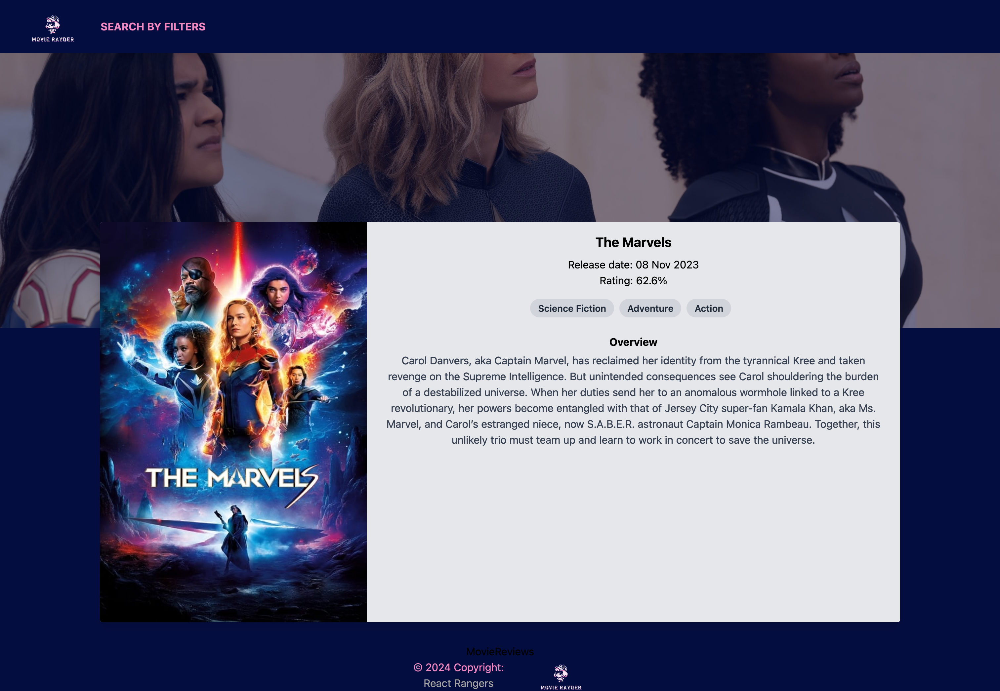

  # React Rangers
      
  ## Description
      
  Our motivation was to create an apilcation that can be used to search, discover, and diver  deeper in to  more imformation about movies. 
  We build this project to make it easy for a user to find what they are looking for in terms of movies.
  This app solves the problem of looking at different resources and combines all information on one location.
  We learned a lot working on this project, i.e
      
  ## Table of Contents
      
      
  - [Installation](#installation)
  - [Usage](#usage)
  - [Credits](#credits)
  - [License](#license)
      
  ## Installation
      
  In order to run this appication just click the link to the deployed site. alternatively of you want to use the codebase, fork it and run `npm i`  this will install all the dependancies then run `npm run dev` to run the applocation locally.
      
      
  #### Home Page Single Search
  Search for a film my name on the home page and get a quick view of the the details on a card or alternatively, see whats trending this week bellow the search field.

 
  #### Search Filters Page

 
   #### Search Filters Page
 
          
      
      
  ## License
      
 
      
 
      
## Languages 
#### Badges
      

      
      
## Tests
We haven't used any testing libraries yet but this is something we plan to add in the future, but of you are familiar with one it's feel free to fork and add one.

